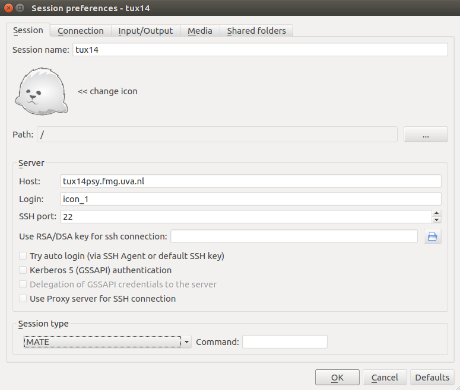

## UPDATE
This service was only meant for the ICON2017 workshop and is thus not relevant anymore. As such, to follow this workshop,
you'll have to install Python as explained [here](configure_python.md).

## Logging in on the analysis server
The psychology department at the University of Amsterdam has several dedicated servers for (neuroimaging) analysis and education.
If you've emailed us to request an account on the server, you should have gotten a reply from us with a username and password.

Note that you *can only access the server at the Beurs van Berlage* during ICON, as the server is restricted to the network of
the University of Amsterdam and, temporarily, the network from the Beurs van Berlage. That means you cannot access the server from
anywere else.

That said, during the workshop you can log in on the server using a remote desktop client. We strongly recommend using [X2Go](http://wiki.x2go.org/doku.php/download:start),
which is available for Windows, Mac, and Linux. Note: Mac users also have to download [XQuartz](https://www.xquartz.org/) in order to use X2Go!

After installing the X2Go client, open the program and start a new session (button top left). Fill in the information as depicted in the image below:

Fill in the username that we've sent to you by email in the field "Login". Then, login with your username and password (from the email):

Now (perhaps after a couple of warnings), you should see a clone of your desktop from your account on the server.
Open a terminal (`CTR+ALT+T`) and navigate to the `tutorial` subdirectory in the workshop-directory:

    $ cd ICON_workshop/tutorial

Then, start the notebook by typing the following in your terminal:

    $ jupyter notebook ICON2017_tutorial.ipynb

**[Back to main page](README.md)**
